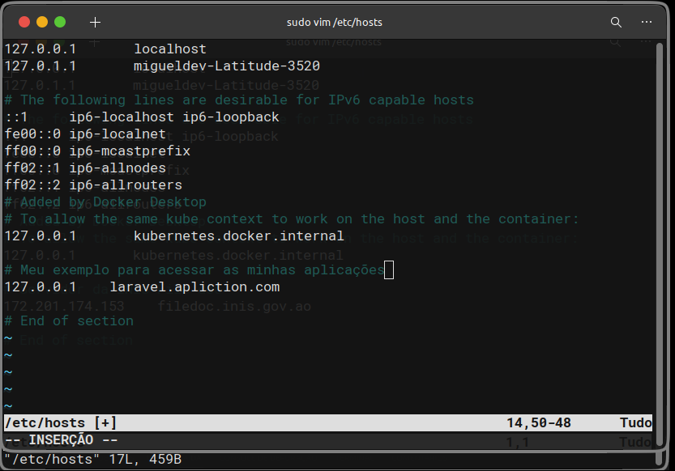

# Ubuntu

O Ubuntu é mais do que apenas um sistema operacional; é uma distribuição Linux que tem uma conexão especial com suas raízes africanas. A palavra "Ubuntu" vem da língua zulu e reflete os valores de humanidade, solidariedade e generosidade. Originário da África do Sul, o Ubuntu foi lançado em outubro de 2004 pela Canonical Ltd.

Descobri o Ubuntu em 2012, graças ao meu pai, LUTINIKO MIGUEL PEDRO LANDU, que o trouxe para casa após concluir seu doutorado na Universidade de Pretória. Desde então, fiquei fascinado pelo sistema e seu compromisso com a acessibilidade, usabilidade e software de código aberto para todos. O Ubuntu não é apenas uma ferramenta tecnológica; é uma expressão dos valores humanos que transcendem fronteiras e culturas.

* **Se você não tem o Ubuntu instalado e está lendo esta minha anotação no Git, é provável que tenha interesse ou até mesmo conhecimento sobre o sistema. Para aqueles que desejam baixar o Ubuntu, deixo aqui o link para download: [Ubuntu Desktop](https://ubuntu.com/download/desktop). Espero que aproveite a experiência com este sistema operacional!**

# Principais comandos

```cmd
sudo apt update && sudo apt upgrade -y
```

**Configurando seu host**

```CMD
sudo vim /etc/hosts
```

Permite abrir as configurações do host ubuntu. Imagine que estás a desenvolver um projecto web, tando com o laravel ou com outra tecnologia, e não pretendes aceçar directamente o ip no browser. No entanto tens a chance de configurar o Host do Ubuntu.

1 - Para ter acesso de escrita neste arquivo, você deve possuir acesso administrativo, também conhecido como "admin".

2 - Caso você tenha acesso administrativo, utilize a tecla `<Insert>` para poder inserir o endereço IP e o seu DNS.

3 - Para sair e salvar as alterações, pressione `<Ctrl+C>`, em seguida digite `:wq` para gravar e sair do arquivo.



Caso não tens o vim instalado use o apt para instalar o vim.

```CMD
sudo apt install vim
```

Nessa minha documentação irei descrever cada gornada e dificulade que tive ao decorer dos anos usando o sistema operacional, e espero que seja para o contributo de toda a comunidade portuguesa.

Esse é minha introdução ao Ubuntu, espero que gostes e cada novidade irei colocar aqui de mode a termos em conjundo o mesmo nivel de conhecimento.
